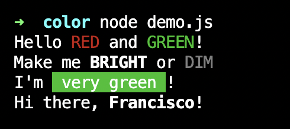

A **copy/paste library** to color your terminal output! Maintained and documented on npm:

```js
// Add color to a string: color('hello {bright}world{/bright}')
// or a template literal: color`hello {bright}world{/bright}`
// Supports NO_COLOR, multiple styles, and closing with "{/}"
// prettier-ignore
const map = {
  reset: 0, bright: 1, dim: 2, under: 4, blink: 5, reverse: 7,

  black: 30, red: 31, green: 32, yellow: 33,
  blue: 34, magenta: 35, cyan: 36, white: 37,

  bgblack: 40, bgred: 41, bggreen: 42, bgyellow: 43,
  bgblue: 44, bgmagenta: 45, bgcyan: 46, bgwhite: 47,
};

const replace = (k) => {
  if (process.env.NO_COLOR) return "";
  if (!(k in map)) throw new Error(`"{${k}}" is not a valid color`);
  return `\x1b[${map[k]}m`;
};

export default function color(str, ...vals) {
  if (typeof str === "string") {
    return str
      .replaceAll(/\{(\w+)\}/g, (m, k) => replace(k))
      .replaceAll(/\{\/\w*\}/g, replace("reset"));
  }

  // Template literals, put them together first and then color them
  return color(str[0] + vals.map((v, i) => v + str[i + 1]).join(""));
}
```

- Simple syntax `color("Hello {green}world{/green}!");`
- Nesting is possible `"Hello {green}beautiful {bright}world{/}!"`.
- Supports [`NO_COLOR`](https://no-color.org/).
- Shortcut `{/}` to remove all prev styles.
- Tiny size, in fact the file above is the whole library.
- Warns you when using an incorrect name.

To use it:

1. Copy it somewhere in your filesystem as `color.js`.
2. Import it from anywhere: `import color from "./color.js";`
3. Use it by wrapping your strings with `color()`.
4. Add some colors to your wrapped strings! 🥳

```js
import color from "./color.js";

console.log(color(`Hello {red}RED{/red} and {green}GREEN{/}!`));
console.log(color(`Make me {bright}bright{/} or {dim}dim{/}`));

// You won't overwrite the prototype with `console.color = ...`, right??
const colog = (...args) => console.log(color(...args));

colog("I'm {bggreen} very green {/}!");
colog`Hi there, {bright}${process.env.USER}{/}!`;
```


